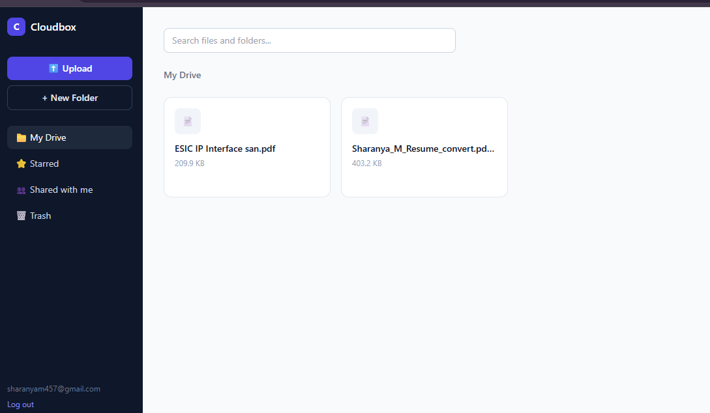
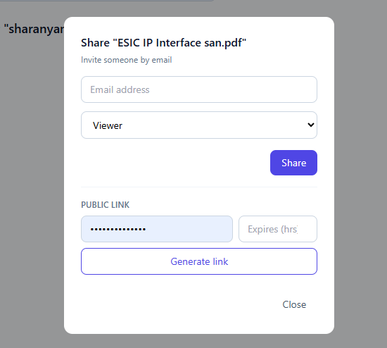
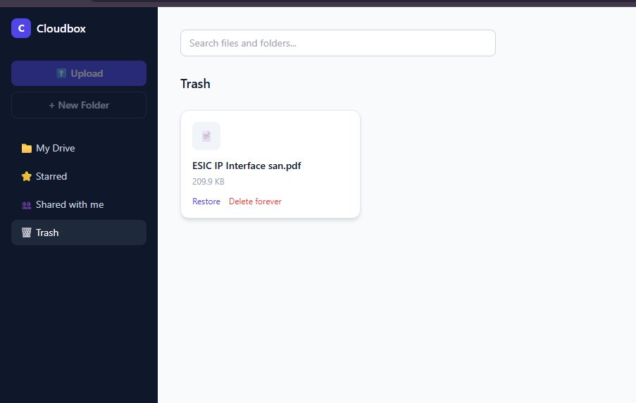

# Cloudbox — Frontend

A cloud storage and file-sharing web app inspired by Google Drive, built with React + Vite + Tailwind CSS. Connects to the Cloudbox backend (Node.js/Express + PostgreSQL via Prisma) for authentication, file storage, sharing, and trash management.

**Live Backend API:** https://cloudbox-backend-jn3d.onrender.com

## Features

- **Authentication** — Register/login with JWT-based auth, persisted in localStorage
- **File & Folder Management** — Create nested folders, upload files via button or drag-and-drop
- **Upload UI** — Real-time upload progress bar, multi-file support, failure states
- **File Preview & Download** — One-click download of stored files
- **Search** — Live search across your files
- **Sort** — Sort files/folders by name, date, or size
- **Sharing** — Share files with other users by email, assign Viewer/Editor roles, manage/remove access
- **Trash** — Soft-delete files and folders, restore or permanently delete them
- **Breadcrumb Navigation** — Navigate nested folder structures easily

## Tech Stack

- React (Vite)
- Tailwind CSS
- Axios (with JWT interceptor)
- React Router

## Project Structure

\`\`\`
frontend/
├── src/
│   ├── components/
│   │   └── ShareModal.jsx
│   ├── context/
│   │   └── AuthContext.jsx
│   ├── pages/
│   │   ├── Login.jsx
│   │   ├── Register.jsx
│   │   ├── Dashboard.jsx
│   │   └── Trash.jsx
│   ├── api.js
│   ├── App.jsx
│   └── main.jsx
├── .env
├── package.json
└── vite.config.js
\`\`\`

## Environment Variables

Create a `.env` file in the project root:

\`\`\`
VITE_API_URL=https://cloudbox-backend-jn3d.onrender.com/api
\`\`\`

## Getting Started

\`\`\`bash
npm install
npm run dev
\`\`\`

App runs by default at `http://localhost:5173`.

## Build for Production

\`\`\`bash
npm run build
\`\`\`

Output is generated in the `dist/` folder, ready to deploy to Vercel or Netlify.

## Screenshots

### Dashboard

### Sharing

### Trash

## Backend

This frontend expects the [Cloudbox backend](../cloudbox-backend) to be running. Make sure `VITE_API_URL` points to a live backend instance.

## Notes

- JWT tokens are stored in `localStorage` under the key `token`. If you see repeated `401 Unauthorized` errors, log out and log back in to refresh the token.